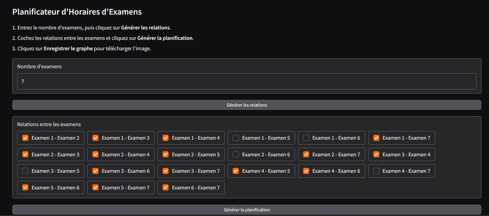
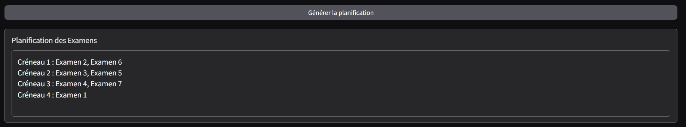
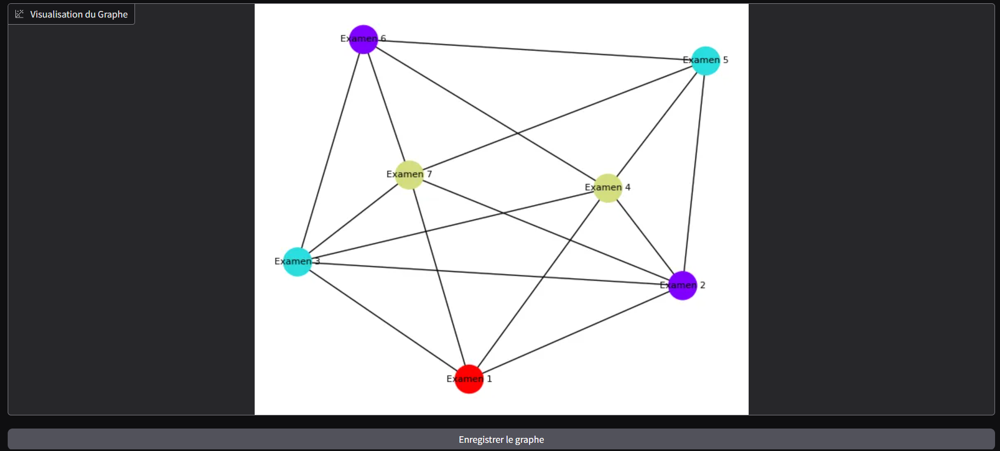
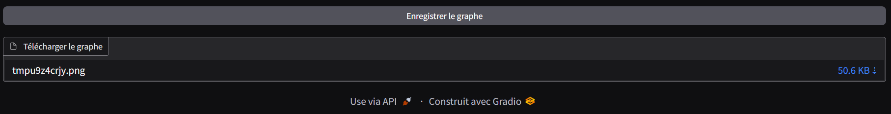

# Exam Schedule Planner

This project creates an exam scheduling planner for a given list of exams and their relationships. The system generates an exam timetable based on these relationships and provides a graphical visualization of the relations between the exams. It also allows the user to download an image of the generated graph.

## Features
- **Creating Exam Relationships**: The user can specify which exams should not be scheduled at the same time.
- **Scheduling Exams**: The system uses a graph coloring algorithm to assign time slots to exams, avoiding conflicts.
- **Graphical Visualization**: A graph is generated representing the relationships between the exams, with different colors indicating different time slots.
- **Downloadable Graph**: The user can download an image of the graph for future reference.

## Usage

### Step 1: Enter Exams and Relationships
- **Enter the number of exams** you want to schedule. For example, enter `5` if you have 5 exams to schedule.
- **Click on "Generate Relations"** to display a list of possible relationships between exams (such as exams that can't be scheduled at the same time).
- **Select the relations** by checking the boxes next to the pairs of exams that must be scheduled in different time slots. For example, if `Examen 1` and `Examen 2` cannot be in the same slot, select that relation.

### Step 2: Generate the Schedule
- **Click on "Generate Schedule"** to create the timetable based on the selected relations.
- A **graph will be displayed** showing the relationships between exams. Each node represents an exam, and edges represent conflicts. Different colors will indicate different time slots (created by the graph coloring algorithm).

### Step 3: Download the Graph
- After generating the graph, you can **download the graph** as an image by clicking on **"Save the Graph"**. This will allow you to keep a visual representation of the exam schedule and relations.

## Example

## Contributing

We welcome contributions! Please feel free to submit issues or pull requests. If you have any questions or need support, feel free to reach out. We welcome any contributions that enhance the project's scope and impact.

## License

This project is licensed under the MIT License. See the [LICENSE](LICENSE) file for details.

